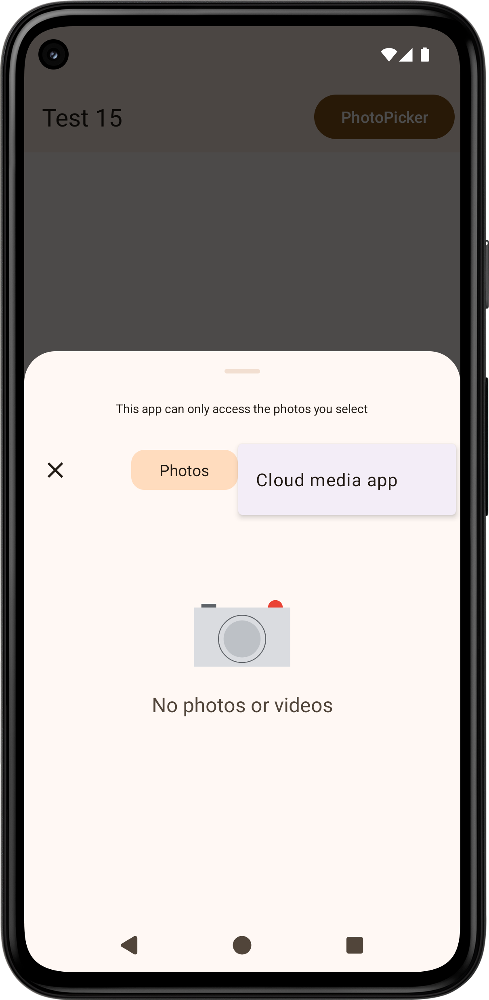

[Photo Picker] The background color of menu ("Cloud media app") is not dynamic color.

See also: https://github.com/material-components/material-components-android/issues/3969,
https://github.com/material-components/material-components-android/issues/4139

https://issuetracker.google.com/issues/400894495

The scrim color of the photo picker is too dark: https://issuetracker.google.com/issues/403485646, https://issuetracker.google.com/issues/365245820, https://github.com/material-components/material-components-android/issues/3635

[Manabu Nakamura](https://github.com/manabu-nakamura)