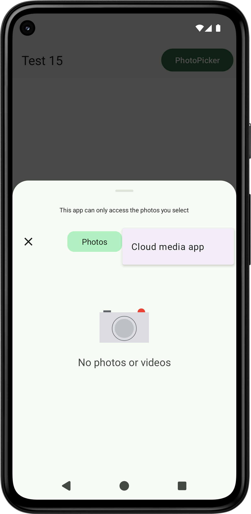

~[PhotoPicker] The background color of menu ("Cloud media app") is not dynamic color, regardless of whether the app is dynamic color or not: https://issuetracker.google.com/issues/400894495.~

~See also: https://github.com/material-components/material-components-android/issues/3969,
https://github.com/material-components/material-components-android/issues/4139.~

[PhotoPicker] The background color of button ("Photos") is always dynamic color, regardless of whether the app is dynamic color or not.

P.S. When the system setting is LIGHT and the app setting is DARK, the photopicker (, the filepicker, and the Gboard) are LIGHT.

[PhotoPicker] The scrim color of the photopicker is too dark: https://issuetracker.google.com/issues/403485646, https://github.com/material-components/material-components-android/issues/3635.

[Manabu Nakamura](https://github.com/manabu-nakamura)